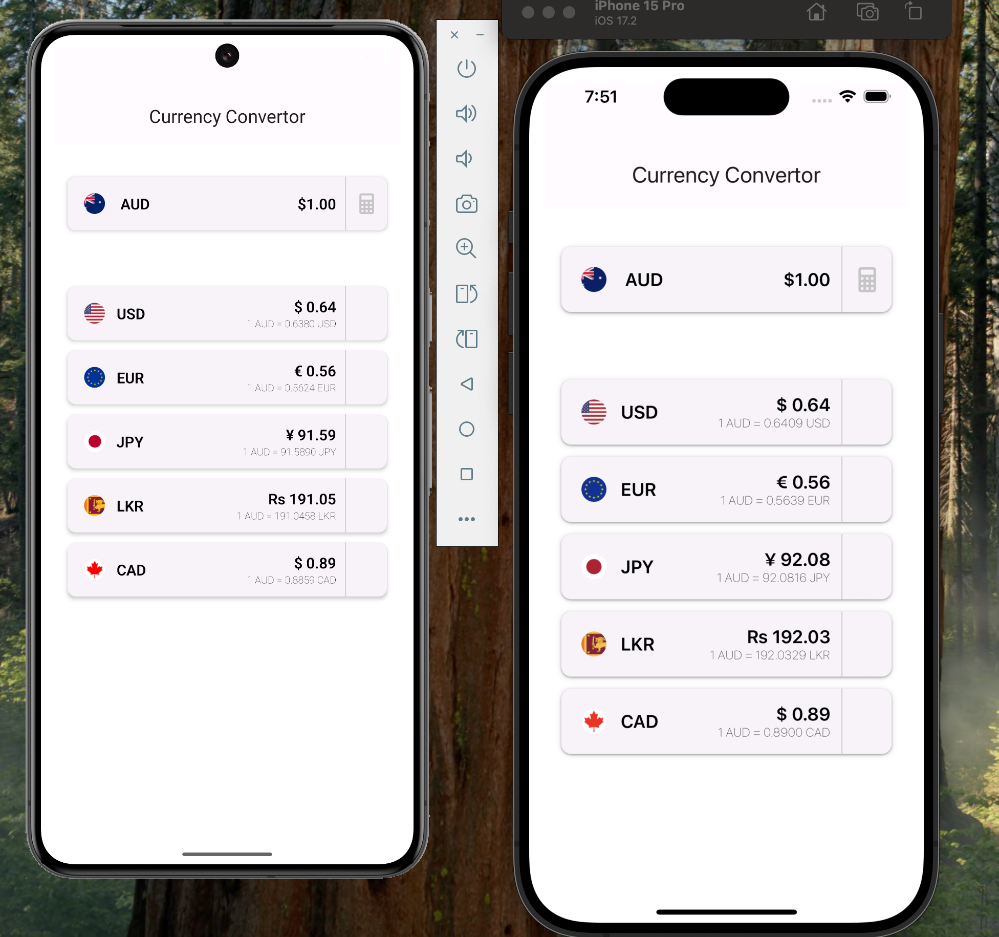
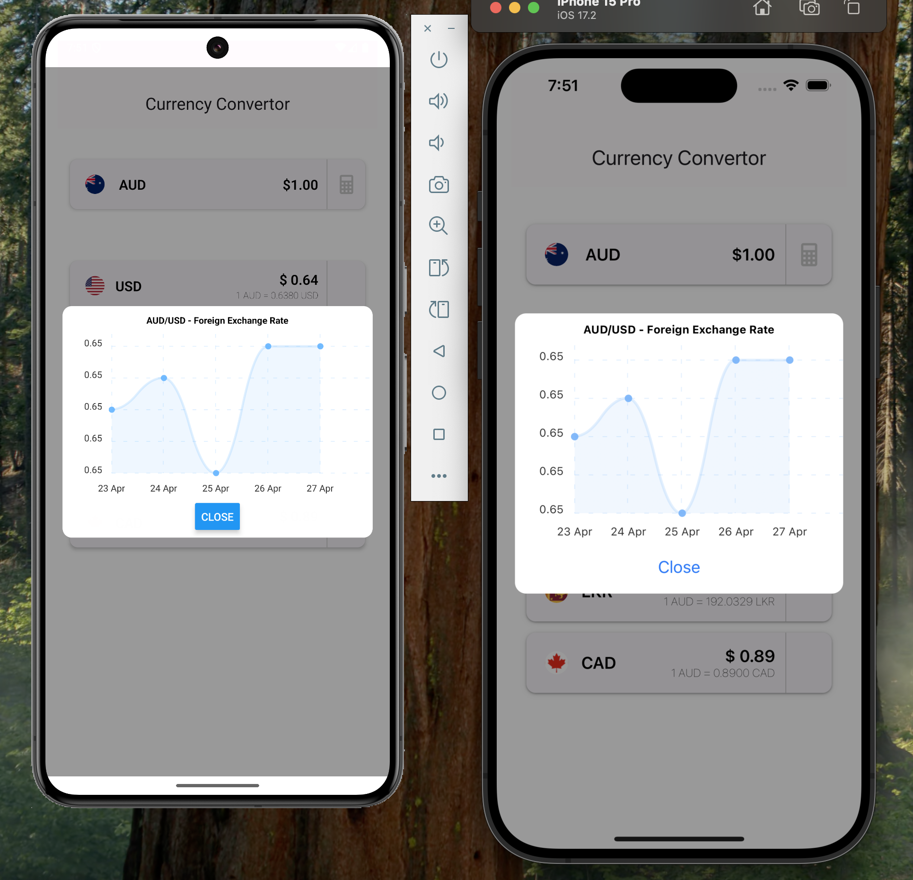

# README #

This README would normally document whatever steps are necessary to get your application up and running.

# React Native Currency Converter

* This is sample test project to convert currency using https://openexchangerates.org/api/ thirdparty API. 
* Used React Native 0.79.1 


# Features

* Convert an amount from AUD (Australian Dollar) to 5 predefined currencies.
* Live exchange rate fetching from Open Exchange Rates API.
* Bonus: Tap on a currency to view a 14-day historical chart


# Tech Stack

* React Native
* Axios for API requests
* React Native Paper package and related packges for theming
* Open Exchange Rates API

# 📦 Installation

* Clone the repository and install dependencies:
 ```
git clone https://github.com/danushkaperera/currencyconvert.git
cd currencyconvert
npm install
```
#or
``` 
yarn install 
```
# Running the App

* Start the Metro bundler:
```
npx react-native start
```
* In another terminal:
```
npx react-native run-android
# or
npx react-native run-ios
```
# Environment Setup

* Update a env.js file in the root directory and add your Open Exchange Rates API key:
```
API_KEY=your_api_key_here
```
# API Reference

* Live Rates Endpoint:
`` https://openexchangerates.org/api/latest.json?app_id=API_KEY ``

* Historical Rates Endpoint:
`` https://openexchangerates.org/api/historical/{date}.json?app_id=API_KEY ``

## 📸 Screenshots

### Home


### Chart

